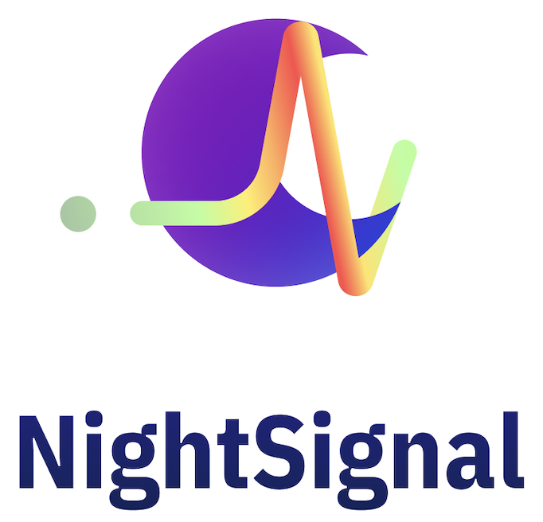
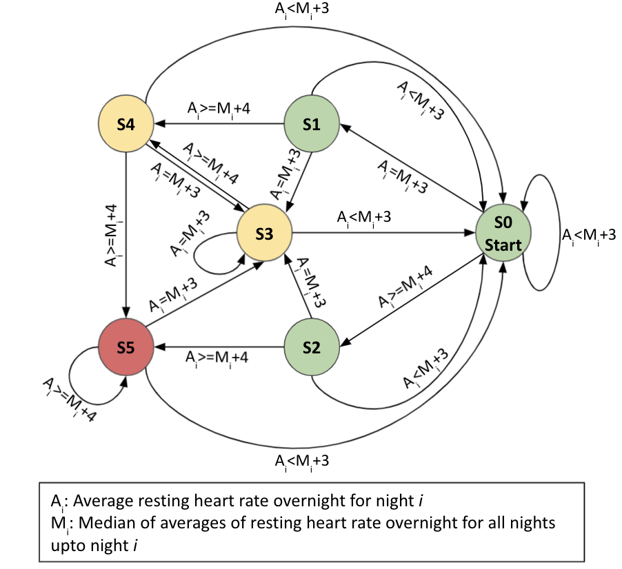
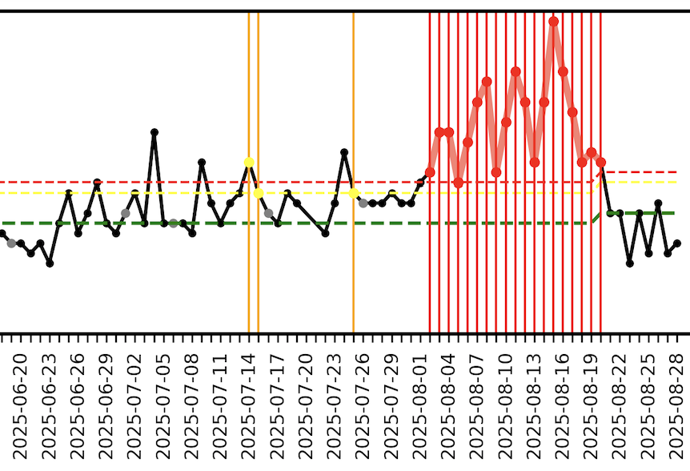
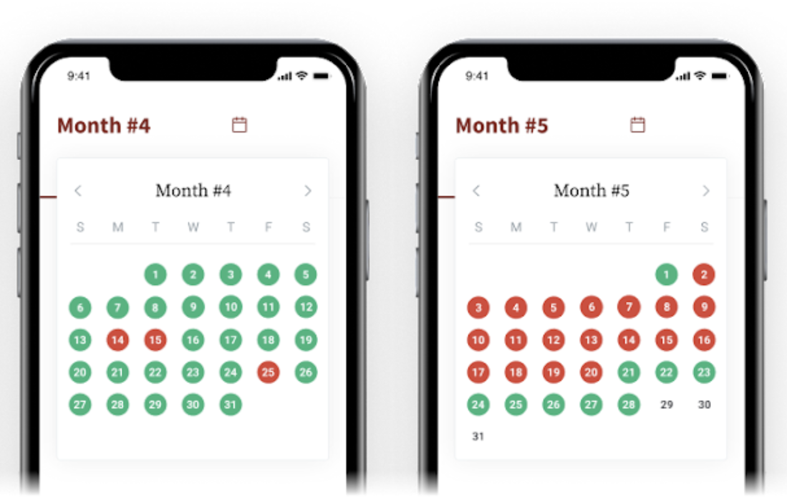

# wearable-infection
Real-time detection of infection diseases using wearables




</br>

# NightSignal Algorithm:

Online pre-symptomatic and asymptomatic detection of COVID-19 using wearables data. The current version of NightSignal algorithm works on Fitbit and AppleWatch heart rate and steps data.

**Preprocessing:**

Given the heart rate and step data (e.g., P355472-AppleWatch-hr.csv and P355472-AppleWatch-st.csv files), the resting heart rate (RHR) overnight is calculated for each day by averaging the heart rate values where the corresponding step value is zero (i.e. minute resolution in the case of Fitbit and various ranges - e.g., 5 or 15 minutes - in the case of Apple Watch). 

**Healthy baseline:**

The healthy basline for each indivicdual is calculated as the median of average RHR overnight.

**Generating alerts:**

After the healthy baseline is established, the alerts are generated using the following deterministic finite state machine:




## Requirements and Usage

**Requirements:**
- Python 3
- MatplotLib
- NumPy
- Pandas

<br/>

**Required packages command:**

Use the following command to install the required Python packages

  ```pip install -r requirements.txt```

<br/>

**Usage:**

  For each wearable, use the following command to run NightSignal algorithm on heart rate and step data. The outputs are: 1) A JSON file for the real-time alerts and 2) A plot showing the average RHR overnight and corresponding healthy baseline and alerts w.r.t the NightSignal Deterministic Finite Automata (DFA).    

> Fitbit:

> ``` python3 nightsignal.py --device=Fitbit --restinghr=<RHR_FILE> ```

> AppleWatch:

> ``` python3 nightsignal.py --device=AppleWatch  --heartrate=<HR_FILE> --step=<STEP_FILE> ```

<br/>

**Example runs:**

`python3 nightsignal.py --device=AppleWatch --heartrate=P355472-AppleWatch-hr.csv  --step=P355472-AppleWatch-st.csv`

`python3 nightsignal.py --device=Fitbit --restinghr=P682517-Fitbit-rhr.csv`

<br/>

**Output example:**

Example of Pre-symptoms Real-time Alerts during COVID-19:  



Below is the corresponding alert file for the above example:

...<br />
{"date": "2025-07-25", "alert": "1"},<br />
{"date": "2025-07-26", "alert": "0"},<br />
{"date": "2025-07-27", "alert": "0"},<br />
{"date": "2025-07-28", "alert": "0"},<br />
{"date": "2025-07-29", "alert": "0"},<br />
{"date": "2025-07-30", "alert": "0"},<br />
{"date": "2025-07-31", "alert": "0"},<br />
{"date": "2025-08-01", "alert": "0"},<br />
{"date": "2025-08-02", "alert": "2"},<br />
{"date": "2025-08-03", "alert": "2"},<br />
{"date": "2025-08-04", "alert": "2"},<br />
{"date": "2025-08-05", "alert": "2"},<br />
{"date": "2025-08-06", "alert": "2"},<br />
{"date": "2025-08-07", "alert": "2"},<br />
{"date": "2025-08-08", "alert": "2"},<br />
{"date": "2025-08-09", "alert": "2"},<br />
{"date": "2025-08-10", "alert": "2"},<br />
{"date": "2025-08-11", "alert": "2"},<br />
{"date": "2025-08-12", "alert": "2"},<br />
{"date": "2025-08-13", "alert": "2"},<br />
{"date": "2025-08-14", "alert": "2"},<br />
{"date": "2025-08-15", "alert": "2"},<br />
{"date": "2025-08-16", "alert": "2"},<br />
{"date": "2025-08-17", "alert": "2"},<br />
{"date": "2025-08-18", "alert": "2"},<br />
{"date": "2025-08-19", "alert": "2"},<br />
{"date": "2025-08-20", "alert": "2"},<br />
{"date": "2025-08-21", "alert": "0"},<br />
{"date": "2025-08-22", "alert": "0"},<br />
{"date": "2025-08-23", "alert": "0"},<br />
{"date": "2025-08-24", "alert": "0"},<br />
{"date": "2025-08-25", "alert": "0"}<br />
...


Finally, the above de-identified file is transfered to [MyPHD](https://apps.apple.com/us/app/myphd/id1447333214) app and after re-identifying the dates to actual dates on the phone, alerts are represented in a calendar base visualization on [MyPHD](https://apps.apple.com/us/app/myphd/id1447333214) app. Then users can annotate the alerts via different surveys (e.g., activities, symptoms, diagnosis, medication, vaccination).




# IsolationForest Algorithm:

Isolation Forest Anomaly Detection algorithm for Fitbit and Apple Watch data can be found in `isolationforest` folder. To apply this algorithm, please run the follwoing command line:

> Fitbit:

> ``` python3 isolationforest.py --device=Fitbit  --heartrate=<HR_FILE> --step=<STEP_FILE> ```

> AppleWatch:

> ``` python3 isolationforest.py --device=AppleWatch  --heartrate=<HR_FILE> --step=<STEP_FILE> ```

Results can be found in the output file, `if_anomalies.csv`. 
