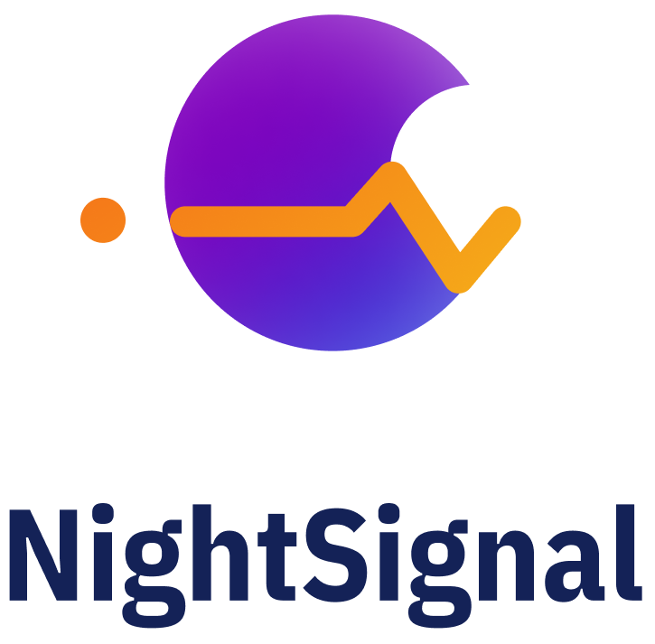

# wearable-infection
Real-time detection of infection diseases using wearables



# NightSignal Algorithm:
Online pre-symptomatic and asymptomatic detection of COVID-19 using wearables data. The current version of NightSignal algorithm works on Fitbit and AppleWatch heartrate and steps data.

## Usage

**Required packages:**

  Use the following command to install the required Python packages

  ```pip install -r requirements.txt```

<br/>
<br/>

**Command:**

  For each wearable, use the following command to run NightSignal algorithm on heartrate and step data. The outputs are: 1) A JSON file for the real-time alerts and 2) A plot showing the average RHR overnight and corresponding healthy baseline and alerts w.r.t the NightSignal Deterministic Finite Automata (DFA).    

> Fitbit:

> ``` python3 nightsignal.py --device=Fitbit --restinghr=<RHR_FILE> ```

> AppleWatch:

> ``` python3 nightsignal.py --device=AppleWatch  --heartrate=<HR_FILE> --step=<STEP_FILE> ```

<br/>
<br/>

**Example runs:**

`python3 nighsignal.py --device=AppleWatch --heartrate=P355472-AppleWatch-hr.csv  --step=P355472-AppleWatch-st.csv`

`python3 nighsignal.py --device=Fitbit --restinghr=P682517-Fitbit-rhr.csv`

<br/>
<br/>

**Output example:**

Pre-symptoms Real-time Alerts for COVID-19  


